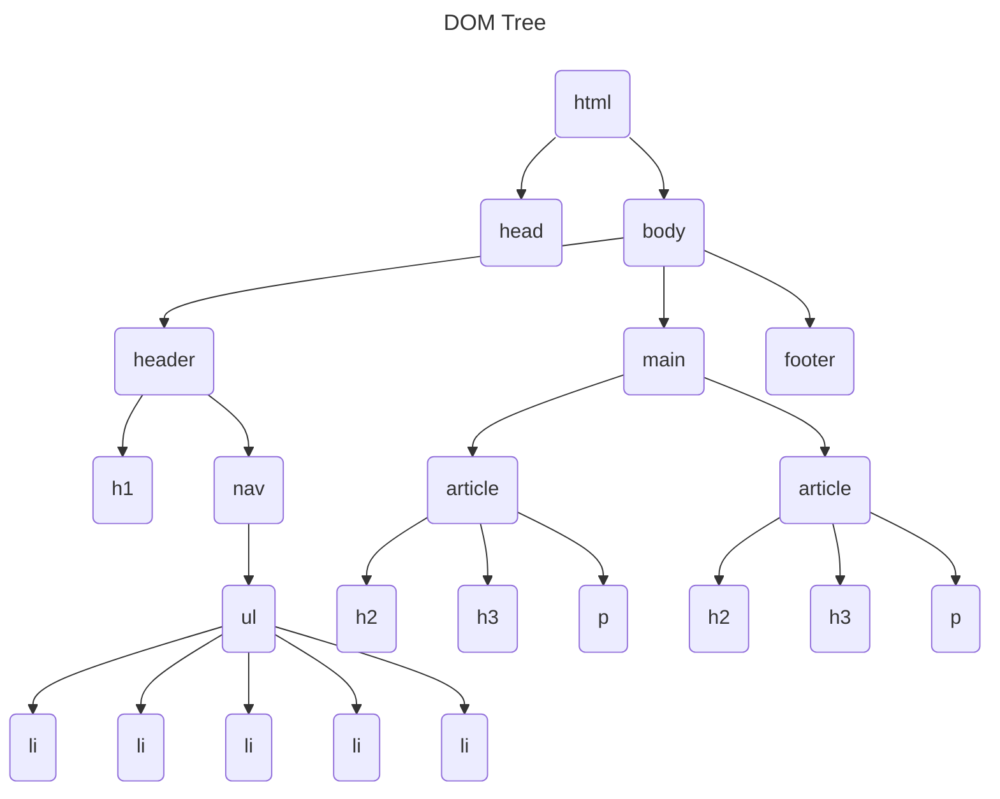

H2 - oefeningen notities

# Oefening 1
## Opdracht 1

# Oefening 3: Paginastructuur
## Opgave
Bekijk onderstaande afbeelding (site https://www.vrt.be/vrtnws/nl/)
- welke onderdelen herken je op de pagina? Denk aan titel, header, footer, main, nav, section/article, ...
- herhaal deze oefening voor enkele andere pagina's die je zelf kiest
- maak er vanaf nu een gewoonte van om deze zaken te zoeken/herkennen als je op het internet surft

## Oplossing

id: 5281bdc9c7ce4e66ba79dbc561555103
parent_id: 43163e8ec5b64789bfb7f789b3802ae2
created_time: 2025-01-13T14:00:47.199Z
updated_time: 2025-01-14T09:43:47.174Z
is_conflict: 0
latitude: 51.05434220
longitude: 3.71742430
altitude: 0.0000
author: 
source_url: 
is_todo: 0
todo_due: 0
todo_completed: 0
source: joplin-desktop
source_application: net.cozic.joplin-desktop
application_data: 
order: 0
user_created_time: 2025-01-13T14:00:47.199Z
user_updated_time: 2025-01-14T09:43:47.174Z
encryption_cipher_text: 
encryption_applied: 0
markup_language: 1
is_shared: 0
share_id: 
conflict_original_id: 
master_key_id: 
user_data: 
deleted_time: 0
type_: 1