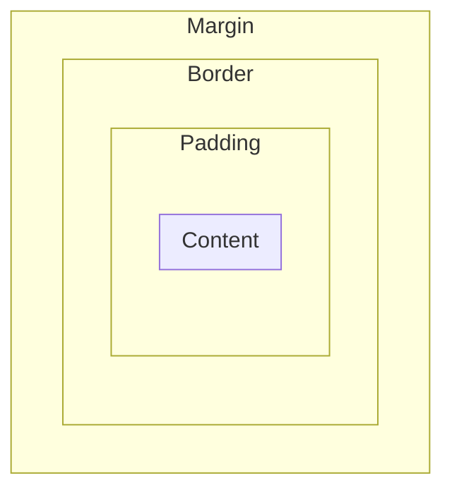

H6 - CSS Lay-out

# Weergave elementen

## block <-> inline elementen

| [Block-elementen](https://developer.mozilla.org/en/docs/Web/HTML/Block-level_elements)                                        | [Inline elementen](https://developer.mozilla.org/en-US/docs/Web/HTML/Inline_elements) |
| ----------------------------------------------------------------------------------------------------------------------------- | ------------------------------------------------------------------------------------- |
| nemen **maximale ruimte** in                                                                                                  | nemen **minimale ruimte** in                                                          |
| voorafgegaan door **nieuwe regel** en gevolgd door **nieuwe regel**                                                           | niet voorafgegaan of gevolgd door nieuwe regel                                        |
| voorbeelden: header, footer, nav, section, article, aside, p, address, div, hx, br, hr, ul, ol, li, dl, dt, dd, table, form,… | voorbeelden: a, img, em, strong, span, input, label,…                                 |

## Display property

kan weergave van element veranderen
veelgebruikte waarden:
| Waarde | Betekenis |
|-|-|
|**inline** | eigenschappen van inline element|
| **block** | eigenschappen van block element|
| **inline-block** | eigenschappen van block element maar wordt in pagina flow weergegeven als inline element|
| **none** | element wordt niet weergegeven|


### Voorbeeld

```css
li {
	display: inline;
	margin-right: 10px;
}
li.coming-soon {
	display: none;
}
```


### Opmerkingen

- is niet common om inline elementen naar block elementen te switchen
- inline-block elementen hebben meestel kleine ruimte tussen elkaar (is normaal, zie verder)

## Visibility property

| Waarde       | Betekenis                                 |
| ------------ | ----------------------------------------- |
| **visible**  | default                                   |
| **hidden**   | verborgen maar ruimte blijft vrijgehouden |
| **collapse** | verborgen en ruimte weg                   |

### Voorbeeld

```css
li {
	display: inline;
	margin-right: 10px;
}
li.coming-soon {
	visibility: hidden;
}
```


# Boxmodel

Elk element van pagina kun je zien als box

| Onderdeel   | Betekenis                                      |
| ----------- | ---------------------------------------------- |
| **content** | bevat tekst & afbeeldingen                     |
|             | wordt bepaald door height & width              |
| **padding** | ruimte rond content                            |
|             | zodat border niet direct aan content vasthangt |
| **border**  | rand rond de padding                           |
| **margin**  | ruimte rond border                             |
|             | is volledig transparant                        |



## totale ruimte van een element

- **Actual width** $=$ margin-right $+$ border-right $+$ padding-right $+$ width $+$ padding-left $+$ border-left $+$ margin-left
- **Actual height** $=$ margin-top $+$ border-top $+$ padding-top $+$
  height $+$ padding-bottom $+$ border-bottom $+$ margin-bottom

## Width en height

- default breedte wordt bepaald door display property
  - block: max beschikbaar
  - inline: min nodig
- default hoogte wordt bepaald door inhoud
- instelbaar via width en height property
  - enkel voor block en inline-block (inline neemt steeds breedte & hoogte van inhoud!)
  - mogelijke values:
    - pixels - px
    - percent - % (t.o.v. parent element)
    - relatieve waarde tov grootte gebruikte lettertype - em (1em = breedte van M)
    - relatieve waarde tov grootte gebruikte lettertype **in root element** - rem
  - hoogte bij voorkeur niet instellen
    - veroorzaakt mogelijsks problemen
    - behalve bij afbeeldingen

## padding

- ruimte tussen inhoud & rand
- neemt achtergrondkleur van element aan (anders achtergrondkleur van parent element)

## margin

- ruimte aan buitenkant van element (voor witruimte tussen elementen)
- altijd transparant
- blokken centreren: linker- en rechtermarge op auto

### Margin & padding declaraties

- padding en margin werkt anders voor block en inline
  - Je kan ruimte links en rechts toevoegen: margin-left, margin-right
  - Je kan de hoogte van een inline element echter niet veranderen door instellen padding en margin
- verkorte notatie:

```css
/*top right bottom left*/
p{
	padding: 10px 25px 10px 5px;
}
/*topbottom leftright*/
p{
	padding: 0 2em;
}
/*top leftright bottom*/
p{
	padding: 0 2em 1em;
}
```

- horizontaal centreren

```css
div{
	/* top en bottom krijgen waarde 0, blok wordt gecentreerd in het ouderelement*/
	margin: 0 auto;
}
```

- verticaal centreren
  - niet mogelijk met margin top en bottom auto (zie grid en flexbox)

## border

| Property     | Waarden                                                                            |
| ------------ | ---------------------------------------------------------------------------------- |
| border-width | px, %, em, rem, thin, medium, thick                                                |
| border-style | none / hidden / dotted / dashed / solid / double / groove / ridge / inset / outset |
| border-color | (een kleurwaarde of transparent)                                                   |
| border       | shorthand e.g. 1px solid black;                                                    |

- Als rand transparant: je ziet achtergrondkleur van element

### Declaraties

je hebt border-top, border-right, ...

## extra

# Extra opmaak

## collapsing margins

Wanneer bottom margin van 1 element de top margin van ander element overlapt, is het resultaat NIET de som, maar de grootste margin.

### Collapsing margins tussen opeenvolgende elementen (verticaal)

voor aangrenzende verticale blokelementen in de normale flow, wordt de grootste marge behouden. De kleinste marge zal dichtklappen (wordt 0)


### Collapsing Margins tussen parent en first/last child

Enkel indien geen padding, borders tussen parent en child, dus enkel aaneengrenzende marges $\implies$ marges worden samengevoegd en grootste wordt toegepast


### Oplossing collapsing margins

Iets toevoegen aan box:

- voeg padding toe $\implies$ geen overlapping meer
- voeg border toe

## Negative margins

Om overlappende blokken te maken

## Begrensde width en height

```css
div {
	min-width: 100px;
	max-width: 100px;
	min-height: 100px;
	max-height: 100px;
}
```

Opletten: zorg dat box niet te klein wordt voor content.
Oplossen a.d.h.v. overflow:

- **visible**: default value, zal de tekst buiten de box weergeven, niet vaak gewenst.
- **hidden**: zal de tekst, die niet meer binnen de box past verbergen.
- **scroll**: zal een schuifbalk weergeven in de box.

Enkel horizontaal/verticaal is ook mogelijk: overflow-x / overflow-y

## Totale breedte & hoogte

**box-sizing** beïnvloedt hoe browsers met width & height omgaan
Mogelijke waarden:

- **content-box** - ingestelde width en height hebben enkel betrekking op de content (default)
- **border-box** - ingestelde width en height hebben betrekking op de content + de padding + de border (vaak bij liquid layout)

## afgeronde hoeken – shadow (box-tekst)
- [Border-radius](https://developer.mozilla.org/en-US/docs/Web/CSS/border-radius) - radius van randen van element
- [Box-shadow](https://developer.mozilla.org/en-US/docs/Web/CSS/box-shadow) - drop-shadow toevoegen aan box
	- horizontal & vertical offset
	- blur distance
	- spread / distance
	- kleur
```css
p.one {
    box-shadow: -5px -5px #777777;
}

p.two {
    box-shadow: 5px 5px 5px #777777;
}

p.three {
    box-shadow: 5px 5px 5px 5px #777777;
}

p.four {
    box-shadow: 0 0 10px #777777;
}

p.five {
    box-shadow: inset 0 0 10px #777777;
}
```

- [Text-shadow](https://developer.mozilla.org/en-US/docs/Web/CSS/text-shadow)
	- Horizontale offset
	- Verticale offset
	- Blur afstand (optioneel)
	- Kleur
```css
p.one {
    background-color: #eeeeee;
    color: #666666;
    text-shadow: 1px 1px 0px #000000;
}

p.two {
    background-color: #dddddd;
    color: #666666;
    text-shadow: 1px 1px 3px #666666;
}

p.three {
    background-color: #cccccc;
    color: #ffffff;
    text-shadow: 2px 2px 7px #111111;
}

p.four {
    background-color: #bbbbbb;
    color: #cccccc;
    text-shadow: -1px -2px #666666;
}

p.five {
    background-color: #aaaaaa;
    color: #ffffff;
    text-shadow: -1px -1px #666666;
}

p {
    padding: 20px;
    text-align: center;
    font-size: 200%;
}
```
## cursor style


id: bd7ec7fb995a49b688df272b1e0e37a3
parent_id: 43163e8ec5b64789bfb7f789b3802ae2
created_time: 2025-01-16T10:22:25.854Z
updated_time: 2025-01-16T14:47:27.281Z
is_conflict: 0
latitude: 51.05434220
longitude: 3.71742430
altitude: 0.0000
author: 
source_url: 
is_todo: 0
todo_due: 0
todo_completed: 0
source: joplin-desktop
source_application: net.cozic.joplin-desktop
application_data: 
order: 0
user_created_time: 2025-01-16T10:22:25.854Z
user_updated_time: 2025-01-16T14:47:27.281Z
encryption_cipher_text: 
encryption_applied: 0
markup_language: 1
is_shared: 0
share_id: 
conflict_original_id: 
master_key_id: 
user_data: 
deleted_time: 0
type_: 1