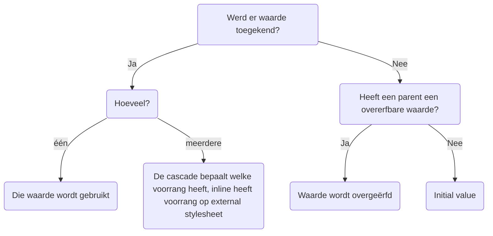
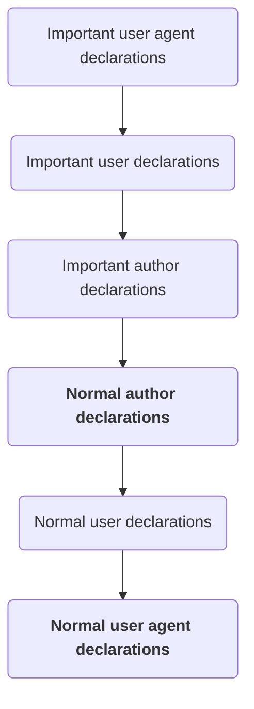

H5 - CSS basis deel 2

 # Inleiding Cascading - Inheritance
# CSS verwerking door browsers: cascading - inheritance
## Cascading - inleiding
**user agent stylesheet** = browser stylesheet
**author stylesheet** = server stylesheet

Hoe specifieker de selector, hoe hoger de prioriteit op toepassen.
## Inheritance - inleiding
Descendants ervern stijlregels over indien mogelijk (vnl. tekstgerelateerde regels)
## Cascading - Inheritance
Hoe browser webpagina opbouwt:

Berekening van waarde voor elke CSS-eigenschap:

# Cascading
## Origin, importance
CSS tijlen kunnen origineren van
- **User-Agent Origin** - user agent stylesheet / browser stylesheet
	- bevat standaardstijlen die browser toepast op pagina
	- kan overschreven worden door user / author stylesheet
- **User Origin** - user stylesheets
	- eigen stylesheet van bezoeker (eg voor accessibility / extensies)
- **Author Origin** - autor stylesheets
	- door web developer, in 1 / meerdere .css-files
- **inline** styles
### Importance
Prioriteit van declaration verhogen (ook tov style in html file)
```css
p {font-size: 1.2em !important;}
```
### Volgorde

## Specificity
Als zelfde origin en importance, dan specificity (hoe meer getal naar links, hoe meer waard)

## Source order
Als importance, origin & specificity gelijk, dan source order (laatste in bestand)
# Inheritance
## Overerfbare eigenschappen
Tekst gerelateerde properties:
- color, font-family, font-size, font-style, text-align, text-transform, ….

List properties:
- list-style-image, list-style-position, list-style-type, list-style
### Computed value
Gepropageerde waarden via inheritance worden opnieuw berekend indien nodig.

Zo zal `<em>` element in `<p>` de font-size in pixels overerven en niet `0.8em`, anders zou `<em>` kleiner zijn dan `<p>`

Overerfbare eigenschappen voor volledige pagina horen in:
- body
- wrapper div

Niet-overerfbare eigenschappen kunnen toch overgeërfd worden door `inherit` erbij te plaatsen.
## Wat met niet overerfbare eigenschappen?
- Indien geen expliciete stijl: initial value
- op MDN kun je initial value van dingen terugvinden.
# Developers Tools - CSS verwerking door browsers

# CSS values and units
- **value type** van CSS-property = mogelijke waarden ervoor
	- meestal genoteerd met `<>` (om te onderscheiden van property zelf)
# Browser `reset/normalize.css`
- Verschillende browsers hebben licht afwijkende browser stylesheets
- Om uniforme stylesheet te bekomen:
	- `reset.css` van Eric Meyer
	- `normalize.css` van Nicolas Galagher
```html
<head>
	/* … */
	<title>….</title>
	<link rel="stylesheet" href="css/normalize.css" />
	<link rel="stylesheet" href="css/site.css" />
</head>
```
of in CSS code
```css
@import url("normalize.css");
```
# Web fonts
**web font** = font file waaruit browser fonts kan laden vanaf een server
```css
@font-face {
font-family: 'my font';
src: url(../fonts/AlexBrush-Regular.ttf);
}
```
Bestandsformaten die door meeste browsers ondersteund worden:
- .TTF (TrueType)
- .OTF (OpenType)
- .WOFF (Web Open Font Format) (speciaal voor web ontwikkeld)
- .WOFF2 (Web Open Font Format 2) (speciaal voor web ontwikkeld)
# Font pairing
Goede font pairing bepaalt visual hierarchy & verbetert leesbaarheid

id: fa6ff966b2e74a1a8f54d33553509594
parent_id: 43163e8ec5b64789bfb7f789b3802ae2
created_time: 2025-01-15T16:26:52.707Z
updated_time: 2025-01-15T18:51:01.948Z
is_conflict: 0
latitude: 51.05434220
longitude: 3.71742430
altitude: 0.0000
author: 
source_url: 
is_todo: 0
todo_due: 0
todo_completed: 0
source: joplin-desktop
source_application: net.cozic.joplin-desktop
application_data: 
order: 0
user_created_time: 2025-01-15T16:26:52.707Z
user_updated_time: 2025-01-15T18:51:01.948Z
encryption_cipher_text: 
encryption_applied: 0
markup_language: 1
is_shared: 0
share_id: 
conflict_original_id: 
master_key_id: 
user_data: 
deleted_time: 0
type_: 1