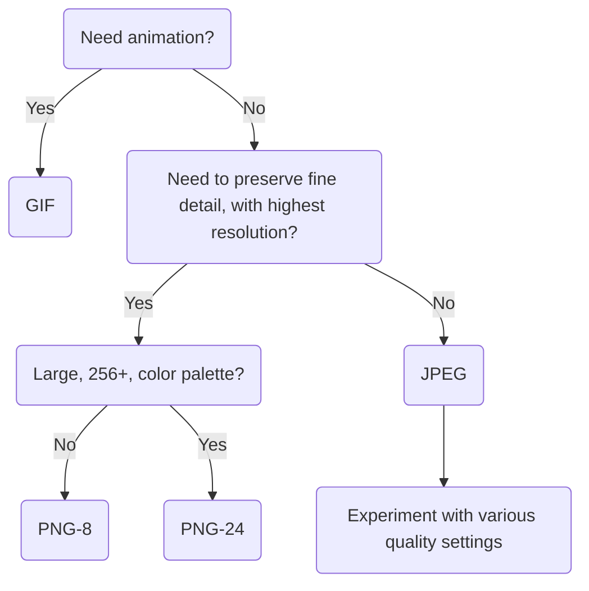

H2 - HTML basis deel 2

# Mozilla Developer Network

Info over elementen beschikbaar via VSCode


# Lijsten

## Ordered List

bestaat uit list items

```
<ol>
	<li>item 1</li>
	<li>item 2</li>
</ol>
```

<ol>
	<li>item 1</li>
	<li>item 2</li>
</ol>

## Unordered List

bestaat uit list items

```
<ul>
	<li>item 1</li>
	<li>item 2</li>
</ul>
```

<ul>
	<li>item 1</li>
	<li>item 2</li>
</ul>

## Description / Definition List

bestaat uit

- description term **dt**
- description details **dd**

```
<dl>
	<dt>term 1</dt>
	<dd>details 1</dd>
	<dt>term 2</dt>
	<dd>details 2</dd>
</dl>
```

<dl>
	<dt>term 1</dt>
	<dd>details 1</dd>
	<dt>term 2</dt>
	<dd>details 2</dd>
</dl>

# Block- en inline elementen (`<div>` en `<span>`)

## Block vs inline

indeling bestaat niet meer in HTML5
|| Block (`<h1>`, `<p>`, ...) | Inline (`<a>`, ``, ...) |
|-|-|-|
|op nieuwe regel|ja|nee|
|breedte|max beschikbaar|min nodig|


## Non-semantic elements

enkel gebruiken als geen semantisch element past!

- algemene container
- om elementen te groeperen (css)
<table>
	<tr><th>&ltdiv&gt</code></th><td>block</td></tr>
    <tr><th>&ltspan&gt</code></th><td>inline</td></tr>
</table>

# Text block-level elements

| HTML-tag               | betekenis                                                     |
| ---------------------- | ------------------------------------------------------------- |
| `<ol>`, `<ul>`, `<dl>` | lijsten                                                       |
| `<blockquote>`         | lange citaten                                                 |
| `<figure>`             | groepeert illustratie (tabel, grafiek, citaal) met bijschrift |
| `<figcaption>`         | bijschrift                                                    |
| `<address>`            | contactinformatie                                             |
| `<pre>`                | behouden van tabs, witruimte, etc in code (pre-formated)      |
| `<hr>`                 | thematische scheiding tssn paragrafen                         |

# Text inline elements

| HTML-tag   | betekenis                                  |
| ---------- | ------------------------------------------ |
| `<strong>` | <strong>nadruk leggen</strong>             |
| `<em>`     | <em>klemtoon leggen</em>                   |
| `<b>`      | <b>aandacht van lezer trekken</b>          |
| `<i>`      | <i>leesbaarheid vergroten</i>              |
| `<small>`  | <small>aanvullende info</small>            |
| `<cite>`   | <cite>naam auteur/creatief werk</cite>     |
| `<q>`      | <q>korte citaten</q>                       |
| `<abbr>`   | <abbr>abbreviation</abbr>                  |
| `<dfn>`    | <dfn>definitie</dfn>                       |
| `<code>`   | <code>programma code</code>                |
| `<time>`   | <time>tijdstip / datum</time>              |
| `<samp>`   | <samp>computer uitvoer</samp>              |
| `<kbd>`    | <kbd>keyboard input</kbd>                  |
| `<s>`      | <s>info die niet meer klopt (suppress)</s> |
| `<sub>`    | abc<sub>subscript</sub>                    |
| `<sup>`    | abc<sup>superscript</sup>                  |
| `<mark>`   | <mark>gemarkeerd</mark>                    |
| `<ins>`    | <ins>inhoud toegevoegd</ins>               |
| `<del>`    | <del>inhoud verwijderd</del>               |

# Hyperlinks

## Hyperlinks

`<a href="link">...klikbare inhoud...</a>`
<a href="link">...klikbare inhoud...</a>

### richtlijnen

- Hyperlink is herkenbaar
- hypertekst
  - duidelijk doel van link
  - informatief (ook buiten context)

## Navigation menu

vaak links in `<ul>` element

## Speciale hyperlinks

### Nieuw tabblad

`<a href="http://www.w3.org" target="_blank">Word Wide Web Consortium</a>`

### e-mailadres

- `<a href="mailto:webmaster@hogent.be">Mail de webmaster</a>`
- met onderwerp `<a href="mailto:webmaster@hogent.be?subject=reactie">Mail de webmaster</a>`

### telefoonnummer

`<a href="tel:+3209828282">Bel de webmaster</a>`

### pdf

- weergeven `<a href="./pdf/h05.pdf" >pdf van hoofdstuk 5</a>`
- downloaden `<a href="./pdf/h05.pdf" download="hoofdstuk 5">pdf van hoofdstuk 5</a>`

# Bookmarks – links

linken naar deel van HTML document
deel moet id hebben
`<a href="index.html#id_van_deel">deel</a>`
als referentie binnen zelfde pagina, dan mag deel voor `#` weg

# Paginastructuur

best headers gebruiken ipv sections om webpagina te structureren (geen headers in sections enzo)

## logische blokken elementen

| HTML Tag    | betekenis                                                             |
| ----------- | --------------------------------------------------------------------- |
| `<section>` | <section>deel van pagina waarvoor geen specifiek element is</section> |
| `<article>` | <article>zelfstandig stuk inhoud</article>                            |
| `<aside>`   | <aside>zijdelinkse info</aside>                                      |
| `<footer>`  | <footer>footer</footer>                                               |
| `<header>`  | <header>kopgedeelte</header>                                          |
| `<nav>`     | <nav>hoofdnavigatie</nav>                                             |
| `<main>`    | <main>hoofdinhoud</main>                                              |

# Afbeeldingen – images

maak niet groter dan nodig (te zwaar anders)
``

- `<src>` source
- `<alt>` korte beschrijving
- `<title>` meer uitgebreide beschrijving (tooltip)

## Soorten

- bitmaps (jpg, png, gif, webp)
- vectorafbeeldingen (svg)



## Thumbnails

afbeelding in het klein die functioneert als link naar volledge afbeelding

# Speciale karakters

| representatie in browser | tekst in html |
| ------------------------ | ------------- |
| &lt;                     | `&lt;`        |
| &gt;                     | `&gt;`        |
| &quot;                   | `&quot;`      |
| &apos;                   | `&apos;`      |
| &amp;                    | `&amp;`       |
| &copy;                   | `&copy;`      |
| non-breaking space       | `&nbsp;`      |
| soft hyphen              | `&shy;`       |
| &plusmn;                 | `&plusmn;`    |
| &mdash;                  | `&mdash;`     |

# Favicon

pictogram in tabblad van browser
`<link rel="icon" href="favicon.ico" type="imahe/x-icon" />`


id: fc4e0452b7104f0b96a09084140d4416
parent_id: 43163e8ec5b64789bfb7f789b3802ae2
created_time: 2025-01-13T13:07:51.960Z
updated_time: 2025-01-13T13:56:06.468Z
is_conflict: 0
latitude: 51.05434220
longitude: 3.71742430
altitude: 0.0000
author: 
source_url: 
is_todo: 0
todo_due: 0
todo_completed: 0
source: joplin-desktop
source_application: net.cozic.joplin-desktop
application_data: 
order: 0
user_created_time: 2025-01-13T13:07:51.960Z
user_updated_time: 2025-01-13T13:56:06.468Z
encryption_cipher_text: 
encryption_applied: 0
markup_language: 1
is_shared: 0
share_id: 
conflict_original_id: 
master_key_id: 
user_data: 
deleted_time: 0
type_: 1